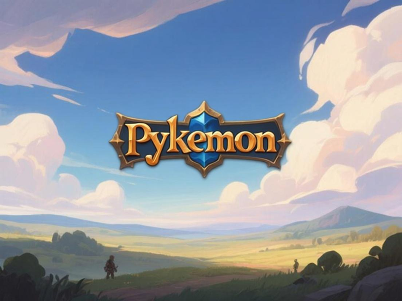

# Pokemon Python Version

<p align="center">
  
</p>

## About the Game

Pokemon Python Version is a modernization of a classic console-style RPG, rebuilt with a Python backend and a Pygame frontend. It features turn-based combat, overworld exploration, and character progression familiar to fans of the monster-catching genre.

The goal of this project was to refactor a text-based Python prototype into a fully graphical experience, integrating professional assets (sprites, backgrounds, UI) and audio while preserving the complex underlying RPG logic (stats, types, moves, evolution).

## Project Structure

```
Pokemon/v2/
├── run_game_gui.py         # Main Entry Point (GUI)
├── main.py                 # Legacy Terminal Entry Point
├── assets/                 # Game Assets
│   ├── images/
│   │   ├── backgrounds/    # Map and Battle backgrounds
│   │   ├── characters/     # Player and NPC sprites
│   │   ├── sprites/        # Pokemon Front/Back sprites
│   │   └── ui/             # Interface elements
│   └── sounds/
│       ├── music/          # Background Music (mp3)
│       └── sfx/            # Sound Effects (mp3)
└── game/                   # Core Game Code
    ├── audio.py            # Audio Manager
    ├── state.py            # Save/Load System
    ├── data/               # Static Data (Stats, Moves, Items)
    ├── logic/              # Game Logic Modules
    │   ├── battle.py       # Turn-based Battle System
    │   ├── exploration.py  # Events and Interactions
    │   └── map_logic.py    # Movement and Exits
    ├── models/             # Data Classes (Pokemon, Trainer)
    └── ui/                 # Visual System
        ├── window.py       # Main Pygame Window
        ├── asset_manager.py# Asset Loading Utility
        └── screens/        # Screen Implementations
            ├── title_screen.py
            ├── map_screen.py
            └── battle_screen.py
```

## Features Implemented

*   **Visual Overworld**: Explore Pallet Town, Routes, and Cities with full graphical backgrounds.
*   **Player Movement**: Grid-free movement with collision detection and map transitions.
*   **Turn-Based Battles**: Full graphical battle interface with HP bars, attack animations, and type effectiveness.
*   **Pokemon System**: 
    *   Stats (HP, Atk, Def, Spd)
    *   Move Sets
    *   Leveling and Evolution
*   **Audio Experience**: Context-aware Background Music and Sound Effects for menus and interactions.
*   **Save/Load System**: Persist your progress (JSON based).
*   **Game Loop**: Smooth transitions between Title, Map, and Battle states.

## To Do / Work in Progress

*   **Dialogue System**: NPCs currently use console/toast outputs; a graphical dialogue box overlay is partially implemented but not fully utilized for conversations.
*   **Inventory UI**: The "Bag" menu in battle and overworld is currently a placeholder or text-based.
*   **Pokemon Switching**: The "PKMN" menu in battle needs a graphical interface for switching team members.
*   **Shop Interface**: Not yet implemented visually.
*   **Animations**: Attack animations are currently text/log based; visual effects (particles) are planned.

## Requirements

*   **Python**: 3.8 or higher
*   **Libraries**: `pygame`
*   **OS**: Windows, macOS, or Linux

## Running the Game

1.  **Install Python**: Ensure Python is installed and added to your PATH.
2.  **Install Dependencies**:
    ```bash
    pip install pygame
    ```
3.  **Run the Game**:
    Navigate to the project directory and execute the GUI runner:
    ```bash
    cd d:/Jogos/Pokemon/v2
    python run_game_gui.py
    ```

## Credits

*   **Developer**: Michel (User) & Antigravity (AI Assistant)
*   **Engine**: Python + Pygame
*   **Assets**: Provided by User (Custom Sprites and Audio)

## License

License: To be defined.
